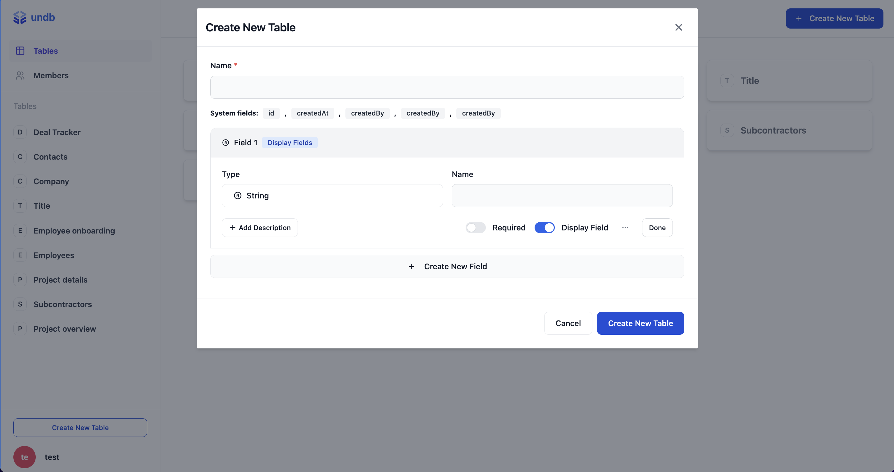
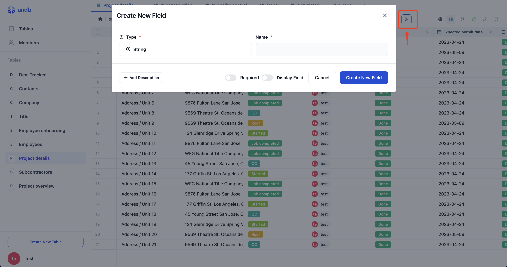
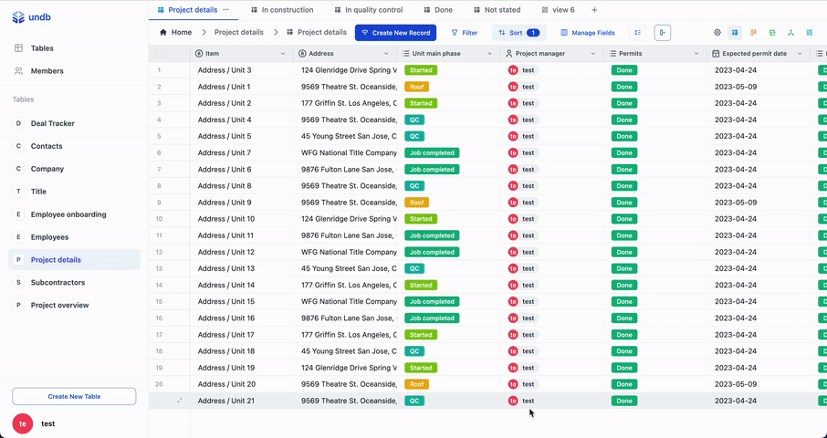
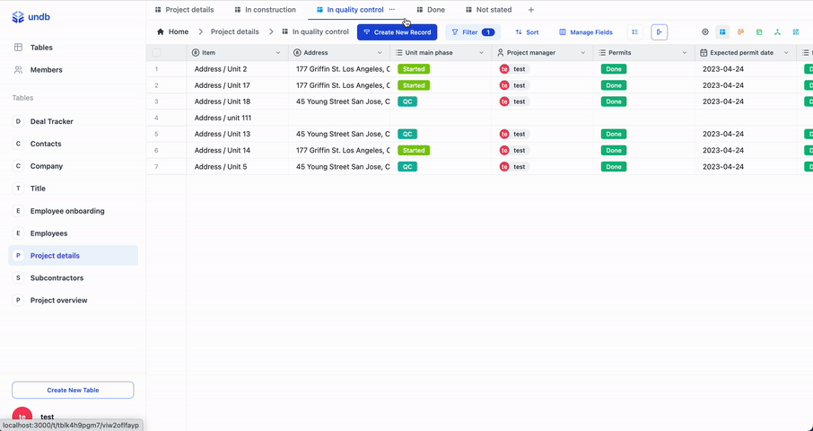

# undb


🚀 Private first, unified, self-hosted no code database.

<a href="https://demo.undb.xyz?lng=en">Live Demo</a>
·
<a href="https://docs.undb.xyz/">Documentation</a>
·
<a href="https://www.undb.xyz/">Website</a>
·
<a href="https://github.com/orgs/undb-xyz/projects/1/views/2?query=is%3Aopen+sort%3Aupdated-desc">Roadmap</a>


## 🚀 Quick Start

- Visit out [Live Demo](https://demo.undb.xyz?lng=en) to try `undb`

- Checkout quick install / deployment [document](https://docs.undb.xyz/installation/1installation-with-docker/)

- Checkout [development envionment setup](https://docs.undb.xyz/contribution/development/) to setup local development environment.

- Open `undb` in [gitpod](https://gitpod.io/new/#https://github.com/undb-xyz/undb) to setup development envionment quickly.

[](https://gitpod.io/new/#https://github.com/undb-xyz/undb)

- Join our [discord](https://discord.gg/3rcNdU3y3U) to keep in touch.

<p>
  <a href="https://discord.gg/3rcNdU3y3U"></a>
</p>

## ✅ Features

- :closed_lock_with_key: Private first
- :balloon: Light weight, requires just one file storage by default
- :computer: Self hosted in seconds
- :pencil: Customizable
- 🔑 Power BI like Record Level Security
- 🔧 Deploy with variant adapters
- 🎮 Developer friendly. Provide openapi / webhooks / realtime subscriptions / sdk(soon) / erd preview and more
- :sparkles: Multiple built-in field types and variants
- :city_sunset: Different types of views, including grid, kanban, gantt, tree, calendar and more
- 💡 Light / Dark theme
- 🗑️ records trash / restore
- 📜 Templates

## 📚 Tech Stack

- 🔥 **SvelteKit** - Simple and performant frontend framework.
- ⚡ **Vite + SWC** - Fast compile ts code.
- 🌊 **Tailwind** - Composable styles.
- 🔧 **Nestjs** Organize backend logic.
- ⚖️ **Domain Driven Design** Make code easy to maintain.

## Screen Shot









#### generated open api


#### erd


## Deploy

### Deploy with docker

```
docker run -d --name undb -p 4000:4000 --platform linux/x86_64 -v ~/.undb/:/var/opt/.undb ghcr.io/undb-xyz/undb:latest
```

> And then you can visit http://localhost:4000 and get started

### Deploy with Render.com

<a href="https://render.com/deploy?repo=https://github.com/undb-xyz/undb">
  
</a>

> You'll need a render account to deploy your own undb instance

### Deploy with Railway

[](https://railway.app/template/tqKa_d?referralCode=pcgp5j)


## License

undb is open-source under the GNU Affero General Public License Version 3 (AGPLv3). You can find it [here](./LICENSE).
