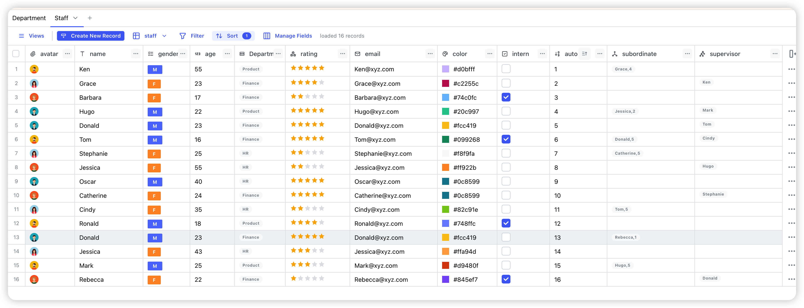

# egodb

Private first, self-hosted no code database.

## Features

- :wrench: Private first
- :balloon: Light weight, requires just one file storage by default
- :computer: Self hosted in seconds
- :pencil: Customizable
- :sparkles: Multiple built-in field types
- :city_sunset: Different types of views

## License

egodb is open-source under the GNU Affero General Public License Version 3 (AGPLv3). You can find it [here](./LICENSE).
