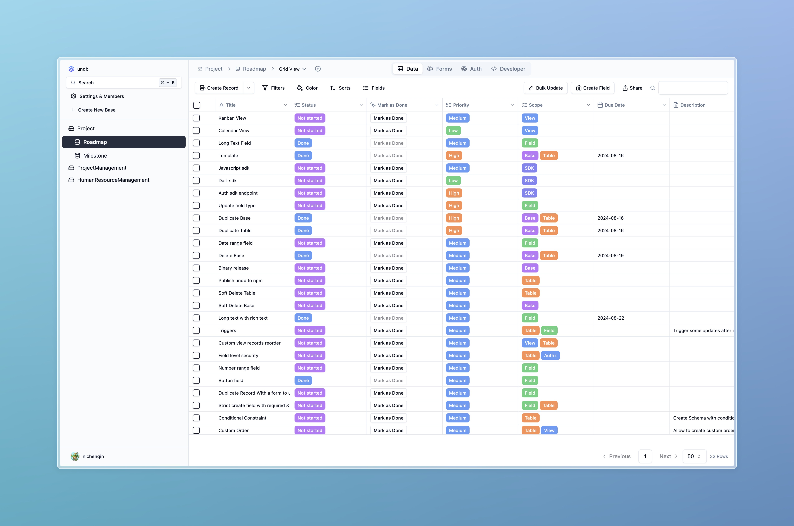

<h1 align="center" style="border-bottom: none">
    <div>
        <a href="https://undb.io">
            
            <br>
            undb
        </a>
    </div>
    The Open Source no code database / BaaS <br>
</h1>

UNDB is a no-code platform that can also serve as a Backend as a Service (BaaS). It is based on SQLite and can be packaged into a binary file using Bun for backend service. Additionally, it can be deployed as a service via Docker, offering a UI for table management.



<div align="center">
    <a href="https://app.undb.io">Website</a> |
    <a href="https://docs.undb.io">Documentation</a> |
    <a href="https://discord.gg/3rcNdU3y3U">Discord</a> |
    <a href="https://app.undb.io/s/v/shrd0q2m4dyijmh">Roadmap</a>
</div>

<div align="center">
    <a href="https://github.com/undb-io/undb/blob/main/LICENSE">
        
    </a>
    <a href="https://github.com/undb-io/undb/releases">
        
    </a>
</div>

<br />

<div align="center">
<a href="https://www.producthunt.com/posts/undb-2?embed=true&utm_source=badge-featured&utm_medium=badge&utm_souce=badge-undb&#0045;2" target="_blank"></a>
</div>

## Features

- ⚡ No-code platform, easy to use
- 🗄️ Based on SQLite, a lightweight database
- 🔐 Private and local first
- 📦 Can be packaged into a binary file using Bun
- 🪜 Progressive deployment, from local in single file to cloud complicated stacks.
- 🐳 Supports Docker deployment
- 🛠️ Provides a UI for table management

## Quick start

- Try [undb cloud](https://app.undb.io)

- Run with docker

```bash
docker run -p 3721:3721 ghcr.io/undb-io/undb:latest
```

## Development

### Local Development (Recommended)

1. **Install Bun**

   Refer to [Bun's official documentation](https://bun.sh/docs) for installation instructions.

2. **Clone the repository**

   ```bash
   git clone https://github.com/undb-io/undb.git
   cd undb
   ```

3. **Install dependencies**

   ```bash
   bun install
   ```

4. **Start the development server**

   ```bash
   bun run dev
   ```

### Docker compose development

```bash
docker compose up -d
```

then visit `http://localhost:3721`

## Build

### Packaging into a Binary File

1. **Build**
   ```bash
   bun run build
   ```

### Docker Deployment

1. **Build the Docker image**

   ```bash
   docker build -t undb .
   ```

2. **Run the Docker container**

   ```bash
   docker run -d -p 3721:3721 undb
   ```
